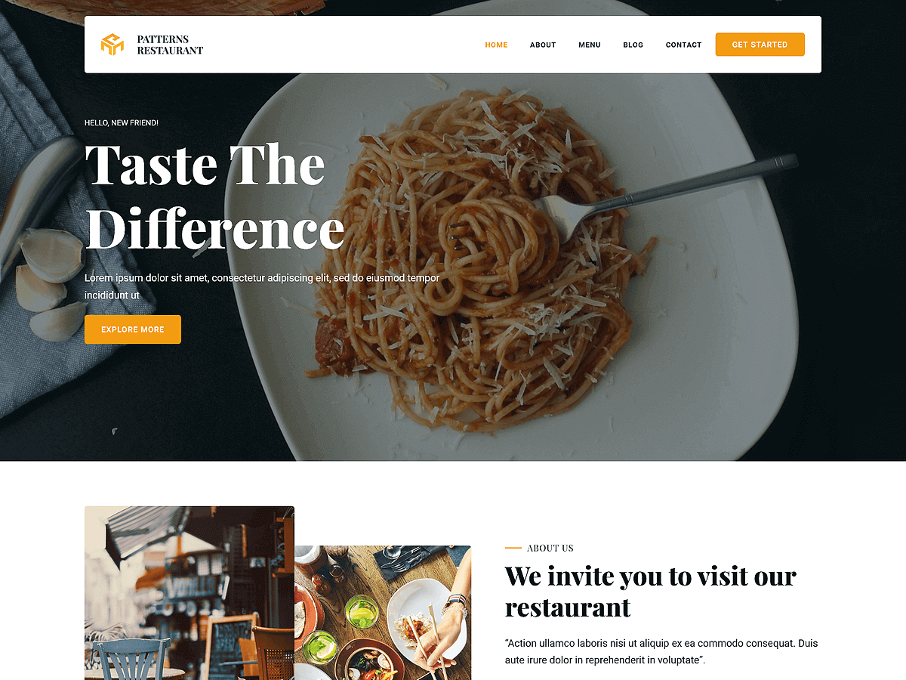

# Patterns Restaurant

Patterns Restaurant is an elegant and modern WordPress theme designed for restaurants, cafés, bistros, and food service businesses. Built with WordPress Full Site Editing (FSE), this theme allows seamless customization of headers, footers, templates, and global styles directly within the WordPress Site Editor. The theme includes pre-designed patterns and layouts crafted for showcasing food menus, chef highlights, customer testimonials, image galleries, online reservations, and contact details. Includes layouts for feature sections, menu offerings, about the restaurant, booking tables, pricing, photo galleries, team introductions, testimonials, contact page, and more. Its responsive design ensures that your website looks appetizing and professional across all devices, providing a stunning platform to engage with your diners.

Primary color: `#f39c12`.



## Features

- 3 hero and landing patterns
- 1 card layout (card-1)
- 5 archive/post-listing patterns
- Contact page pattern (page-contact)
- 2 menu navigation patterns
- 15 section layout patterns (featured sections and section titles)
- Full Site Editing (FSE) support
- Responsive design
- 63 block patterns + 15 templates + 11 template parts
- Restaurant-oriented layouts (menus, reservations, gallery)

## Requirements

- WordPress 6.6 or higher
- PHP 7.0 or higher
- Tested up to WordPress 6.7

## Development

This theme uses `@wordpress/scripts`:

```sh
npm install
npm run start    # dev mode with watch
npm run build    # production build
```

## License

GNU General Public License v2 or later.

This theme is based on [WP Block Theme Boilerplate](https://github.com/codersantosh/wp-block-theme-boilerplate), (C) 2025 Santosh Kunwar, [GPLv2 or later](https://www.gnu.org/licenses/gpl-2.0.html).
